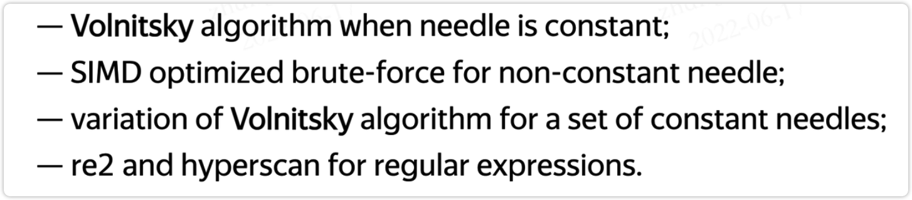
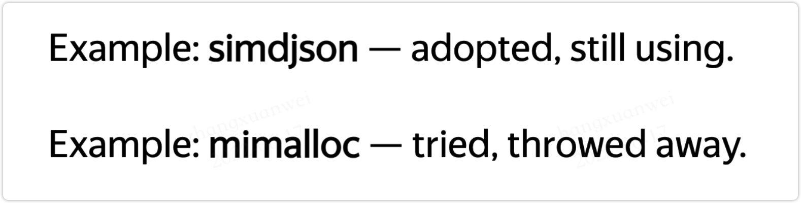
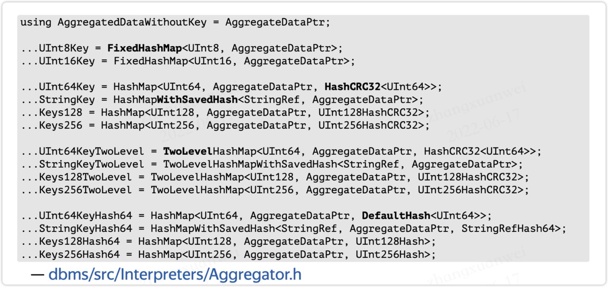
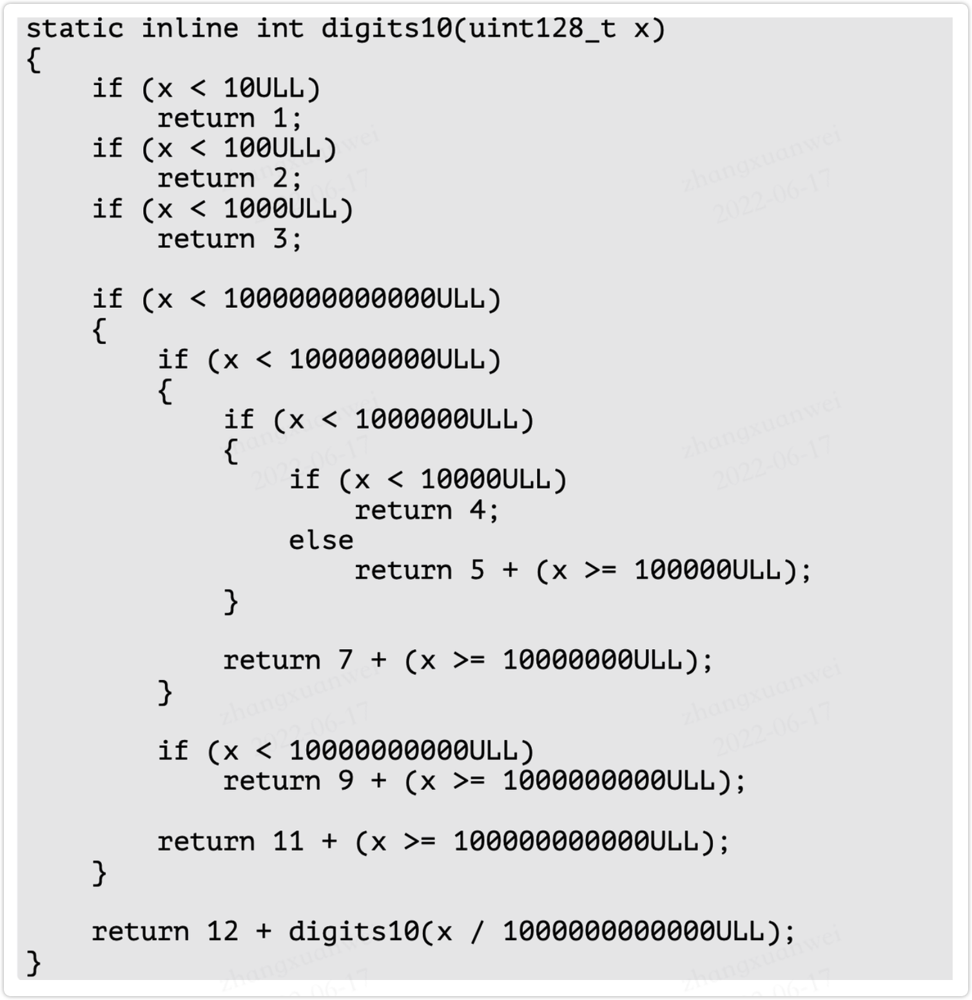

Slide: [https://presentations.clickhouse.com/bdtc_2019/](https://presentations.clickhouse.com/bdtc_2019/)
## Bottom-Up自底向上的设计原则
这个设计的思想就是：当你在考虑一个组件时，必须要考虑到它在底层的执行性能如何。
具体来说可以考虑这么几个问题：

1. work的内层循环是怎么执行的
1. 内存中的数据布局是什么样的
1. 数据流是从哪里来的，又流向了哪里？
1. 我要设计GROUP By
1. 我要用Hash Table，并且要放到内存里
1. 如果HashTable太大那么没法使用L3级缓存
1. 如果GROUP BY的key不是在本地分配的，那么L3缓存对于每一行来说都是miss的
1. L3 miss会造成70-100ns的损失
1. 目前ClickHouse的查询量是175million rows/s
1. 如果L3 miss的话只有40million rows/s
## Algorithm First, Abstractions Go After 算法优先于抽象
应当根据业务，首先考虑出算法，再去考虑具体用什么样的接口去实现这个算法
**内置库函数为什么垃圾以及优化方法**
很简单，Every problem is a landscape。
内置的库函数都是通用的，很难考虑到具体的业务。
比较常见的有

1. 子串查找strstr
1. Sort
1. HashTable
### 子串查找
考虑这么一种情况，有一个模式串(needle)和10000个匹配串(haystack)，如果要调用strstr的话需要
```json
Searcher searcher(needle);
for (const auto &haystack: haystacks)
    searcher.search(haystack)
```
时间复杂度O(n * len(m))
那怎么办呢？~~当然是拿出AC自动机~~
实际上有几十种子串查找算法可以使用 [https://www-igm.univ-mlv.fr/~lecroq/string](https://www-igm.univ-mlv.fr/~lecroq/string)
但是ClickHouse一个都没用，而是根据needle是否为constant采用了下面几种算法
算法的具体介绍在这里 [https://habr.com/en/company/yandex/blog/466183/](https://habr.com/en/company/yandex/blog/466183/)


### Sort排序
排序需要考虑的因素有

1. array的类型，numbers/tuple/string/structure ？
1. 是否需要完全在内存中进行？
1. 是否需要多路归并？等等等等

ClickHouse使用了pdqsort和radix sort
但是实现一般般，需要重写
### HashTable
需要考虑的因素有

1. hash函数的选择
1. 内存布局：开放地址or拉链法？
1. value的大小
1. 是否需要支持value不能被移动？
1. 等等..

ClickHouse的实现方法是
针对不同的业务场景实现N多个Hash函数
## 积极采用最新的算法Grab the best！
积极采用业界最先进的算法
如果有性能提升就采用
否则drop it


## Specialization For the Task 具体的问题具体处理
### LIKE查询
以LIKE查询为例
对于
WHERE str LIKE '%hello%world!%'
来说，常见的解决方案是直接用re2匹配
但是ClickHouse会在这之前扫描一遍字符串，确保'world!'存在
而对于
WHERE str LIKE '%hello%'
则会执行substring search
对于
WHERE str LIKE 'hello%'
则会执行prefix search
### GROUP By
ClickHouse的GroupBy针对不同的数据类型，有40余种不同的HashTable实现


### QuantileTiming 求中位数
对于小于64个数字的数组，在arena申请内存
对于小于5670个数字的数组，在heap申请内存
对于其他的使用custom buckets

## Data Structures are Always in Context of the Task 数据结构需要考虑任务的上下文
如何选择一个数据结构？
想清楚，它需要实现什么，需要哪些，以及不需要哪些
例如std::string

1. 需要自己手动管理内存
1. 需要允许修改字符
1. 需要自己维护size

再比如，如何实现GROUP By？

1. 对数据排序后依次取
1. Hash一下查Hash表

到底是用1还是2呢？
其实还是要看场景，如果数组几乎是排好序的，那么1合适，否则2合适
## Algorithm Know About Data Distribution算法实现时考虑数据分布
一个超硬核的例子。
理论上可以快12倍。
其实通过这个例子也可以看出，真实的数据应该是1/2/3位最多，在12位数以下，9位和10位最多


## Multi-Armed Bandit
Multi-Armed Bandit的来源是这样的：
这类似于赌场中的老虎机，它有几个杠杆，玩家可以拉动这些杠杆来获得一些随机数量的钱。玩家可以按任意顺序多次拉动操纵杆。每个杠杆都有一个固定的概率给出相应的金额，但玩家不知道它是如何工作的，只能从玩游戏的经验中学习。一旦他们弄清楚了，他们就可以最大化他们的奖金。 最大化奖励的一种方法是根据先前步骤的游戏统计数据评估每个步骤中每个杠杆的概率分布。然后，根据收到的分配，我们在心理上为每个杠杆“赢得”随机奖励。最后，我们拉动在我们的心理游戏中获得最佳结果的杠杆。这种方法称为汤普森抽样。
针对于CK，其应用是：对于不同的业务场景，需要选择不同的压缩算法，因此可以先对一小部分数据进行压缩，根据执行的效率并结合概率的因素，选出最终的压缩算法
具体实现看这里https://habr.com/en/company/yandex/blog/457612/
## Testing on Real Data
用真实数据进行测试
## Summary

1. 在设计系统时需要考虑底层的实现细节
1. 基于硬件容量设计
1. 根据任务需要决定数据结构和抽象
1. 对于特殊的case需要给出特殊的解法
1. 尝试新的，好的算法
1. 基于数据选择算法
1. 通过真实数据集进行测试
1. 在CI中测试数据衰减(databend好像是每天结束后会推送一次性能报告）
1. 测量和观察一切事物
1. 不断的重构代码
