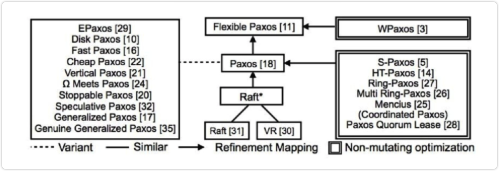

## 一、共识

分布式系统中的一致性实在是太杂糅了，有共识、隔离级别等等，这里只关注共识，尤其是raft、paxos等各种算法。

raft、paxos等各种变形算法，来自On the Parallels between Paxos and Raft, and how to Port Optimizations

## 二、需要了解的先验知识：

### 1.论文

Raft-In Search of an Understandable Consensus Algorithm(Extended Version)阅读笔记 - 不想说的文章 - 知乎 <https://zhuanlan.zhihu.com/p/248136033>

PAXOS Paxos Made Simp阅读笔记 - 不想说的文章 - 知乎 <https://zhuanlan.zhihu.com/p/258929773>

Raft-Paxos关系对应 On the Parallels between Paxos and Raft, and how to Port Optimizations阅读笔记 - 不想说的文章 - 知乎 <https://zhuanlan.zhihu.com/p/453400329>

PBFT Practical Byzantine Fault Tolerance阅读笔记 - 不想说的文章 - 知乎 <https://zhuanlan.zhihu.com/p/465031927>

Byzantizing Paxos by Refinement阅读笔记 - 不想说的文章 - 知乎 <https://zhuanlan.zhihu.com/p/295250296>

略学The Part-Time Parliament阅读笔记 - 不想说的文章 - 知乎 <https://zhuanlan.zhihu.com/p/465763532> （本文应该早点看，可惜顺序在这里，应该是第二篇，在paxos made simple前）

### 2.形式化验证

COQ、dafny、TLA+

关于TLA+的入门请参照 里面有

### 3.未来计划：

更新epaxos、Mecius、FastPaxos、Paxos Quorum Lease、Byzantine Paxos等

**For Epaxos（资料先行整理，当结束了就会放入*二、1.论文*中）**

[祥光：EPaxos三部曲之一：EPaxos基本概念与直观理解](https://zhuanlan.zhihu.com/p/269388025)

[祥光：EPaxos三部曲之二：EPaxos核心协议流程](https://zhuanlan.zhihu.com/p/387468959)

[强连通分量 - 搜索结果 - 知乎](https://www.zhihu.com/search?type=content&q=%E5%BC%BA%E8%BF%9E%E9%80%9A%E5%88%86%E9%87%8F)（epaxos前序知识）

epaxos详解 - 北侠的文章 - 知乎 <https://zhuanlan.zhihu.com/p/35562236>

下面是一个超级强的学长的推荐，一定要看！

[@我做分布式数据库](https://www.zhihu.com/people/d8600e722afa7f33d8ff51d156f9aeb3)

[SoK: A Generalized Multi-Leader State Machine Replication Tutorial](https://link.zhihu.com/?target=https%3A//escholarship.org/uc/item/9w79h2jg)。Michael Whittaker 论文推荐都读一读

[drdr xp：Multi-Master-Paxos: 3](https://zhuanlan.zhihu.com/p/380622806) 一个实现toy 很强大

## 三、学习实现（待续 估计是持续超过一年的项目）

纸上得来终觉浅，绝知此事要躬行，比如自己实现一个toy 分布式数据库with raft or paxos

## 未来

会持续更新，最后可能会得出一个结论